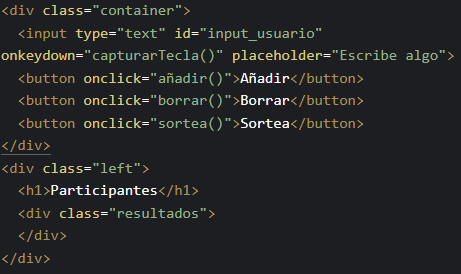
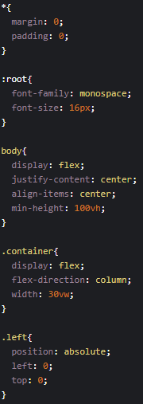

# Examen 1er trimestre BBDD

1º de DAM en ESCAV Granada

Nombre: Javier Camarero López

Fecha: 19/12/2023

## Descripción del examen

Este proyecto trata recrear los requisitos definidos por el profesor en el apartado de práctica. Para cumplir con todos y cada uno de ellos lo primero que he hecho ha sido añadir los archivos necesarios en el repositorio tales como "index.html", "style.css" y "script.js". Una vez creados me he dispuesto a asociar estos archivos en el index para que pueda realizar las funciones especificadas en cada archivo. Una vez está todo asociado, creo los elementos en el archivo HTML que iba a requerir:



Las clases creadas son para una mejor edición estética en CSS. Cada botón consta de una función específica y creo tambien la columna de participantes que será estilizada más adelante.

Teniendo los elementos necesarios en HTML pasé a editar la página y las clases creadas en CSS de la siguiente forma:



Con el "*" edito todo el archivo entero quitándole cualquier tipo de margen que tengan los elementos. En ":root" he definido la fuente y el tamaño de esta. Con "body" edito el body de la página para que todo esté centrado, en columnas y el alto mínimo que tendrá. Con ".container" y ".left" edito las clases de los contenedores para que cada una tenga una configuración diferente.

Una vez terminada la parte visual del proyecto me dispuse a realizar la parte lógica en JavaScript de la siguiente forma:

```
let lista = JSON.parse(localStorage.getItem("lista"));
```

Creo un array que nos saque la información del localStorage.

```
if(lista === null){
  lista = [];
} else {
  for(let i = 0; i < lista.length; i++){
    const elemento = document.createElement("p");
    elemento.innerHTML = lista[i];
    document.querySelector(".resultados").appendChild(elemento);
  }
}
```

Realizo una comparación que me permite dejar la lista vacía en caso de que no haya nada en el localStorage y en caso contrario que me itere sobre esta para escribir en la columna de participantes los participantes anteriores que estaban guardados en la lista del localStorage.

```
function añadir(){
  const valor = document.querySelector("#input_usuario").value;
  lista.push(valor);
  const elemento = document.createElement("p");
  elemento.innerHTML = valor;
  document.querySelector(".resultados").appendChild(elemento);
  document.querySelector("#input_usuario").value = "";
  localStorage.setItem("lista", JSON.stringify(lista));
}
```

Creo la función del botón que añadirá el nuevo participante. Para ello debo meter en esta lista el participante introducido en el input de texto por el usuario y después añadírselo a la columna.

```
function borrar(){
  lista = [];
  document.querySelector(".resultados").innerHTML = "";
  localStorage.removeItem(`lista`);
}
```

Creo la función del botón que borrará la lista de participantes por completo dejándola vacía.

```
function sortea(){
  const ganador = random(lista);
  const p = document.createElement("p");
  p.innerHTML = ganador;
  document.querySelector(".container").appendChild(p);
}
```

Creo la función del botón que sorteará qué participante será el ganador creando un elemento cada vez que se pulsa y asociándolo al contenedor de los resultados.

```
function random(array){
  return array[Math.floor(Math.random() * array.length)];
}
```

Aquí creo una función que me permita sacar un elemento de forma aleatoria de la lista de participantes.

Para finalizar he creado un proyecto en CodePen para añadir el enlace en este archivo para corroborar el funcionamiento del examen por si desde vsCode no se aprecia bien o da fallo:

[Enlace a CodePen](https://codepen.io/Javier-Camarero-L-pez/pen/vYPBEdM?editors=0010)